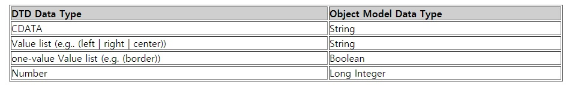

## Property Attributes
- HTML속성은 element객체에 속성으로써 드러난다다. 드러난 속성의 이름은 항상 명명 규칙을 사용하고 원본 문서의 속성의 경우 독립적이다. 속성의 데이터 유형은 HTML4.0 변환및 프레임셋 DTD에의해 결정되는 속성 유형에 따라 결정된다. 속성에는 HTML4.0 사양에 주어진 의미(대소문자 구분)를 가지고 있다.

- 이 속성은 레벨 0에서 호환성을 위해 속성으로 드러난된다. XML과 향후 버전의 HTML이 필요로 하는 모든 가능한 속성 이름을 일반화 할수 없기 때문에 이 용도로는 사용되지 않는다.

DTD 데이터 유형 | 객체 모델 데이터 유형
------------ | -------------
CDATA          |     문자열
값 리스트(left,right,center)| 문자열
단일 값 리스트(border)|boolean
숫자 | long int


- 데이터 유형이 값 리스트인 속성의 반환값은 원본 문서의 값의 경우과는 무관하게 항상 대문자로 시작한다. 예를들어 P element 요소의 정렬 속성 값이 left이면 Left로 반환된다. CDATA 데이터 타입의 속성에 대한 반환 값의 경우는 원본 문서에 주어진 값이다.

## Naming Exceptions
- 공백 이름의 충돌을 피하기 위해 선택한 바인딩 언어중 하나에서 키워드와 이름이 같은 속성이 앞에 붙는다. 예를들어 HTML의 경우 사용되는 접두사는 html이다. 예를들어 LABEL 요소의 for 특성은 루프 구성 명명 규칙과 충돌하여 htmlFor로 이름이 변경된다.

## Exposing Element Type Names (tagName)
- element 타입 이름으로 드러난 속성은 대문자로 반환된다. 예를들어 body element유형의 이름은 tagName속성을 통해 통해 BODY로 보여진다.

## The HTMLElement interface
### Interface HTMLElement
- 모든 HTML elemnet는 이 클래스에서 파생된다. 핵심 속성에서만 드러내는 요소는 기본 HTMLElement 인터페이스로 표현된다. 이러한 element는 다음과 같다.

  - HEAD
  - 특수 : SUB, SUP, SPAN,BDO
  - 폰트 : TT, I, B, U, S, STRIKE, BIG, SMALL
  - 구절 : EM, STRONG, DFN, CODE, SAMP, KBD, VAR, CITE, ACRONYM, ABBR
  - 리스트 : DD, DT
  - NOFRAMES, NOSCRIPT
  - ADDRESS, CENTER

이 속성 스타일은 후에 사용을 위해 예약되어있다.

```c
interface HTMLElement : Element {
           attribute  wstring              id;
           //element의 식별자 
           attribute  wstring              title;
           // 요소의 추가적인 제목
           attribute  wstring              lang;
           //RFC1766으로 정의된 언어 코드
           attribute  wstring              dir;
           //약한, 중립 텍스트에 대해 왼쪽에서 오른쪽, 오른쪽에서 왼쪽으로 방향 지정
           attribute  wstring              className;
           //요소의 클래스 속성, 이 속성은 여러 언어가 보여준 "class" 키워드와의 충돌로 인해 이름이 변경
};
```
[Id_Attribute_Definition](http://www.w3.org/TR/REC-html40/struct/global.html#adef-id)

[Title_Attribute_definition](http://www.w3.org/TR/REC-html40/struct/global.html#adef-title)

[lang_attribute_definition](http://www.w3.org/TR/REC-html40/struct/dirlang.html#adef-lang)

[dir_attribute_definition](http://www.w3.org/TR/REC-html40/struct/dirlang.html#adef-dir)

[class_attribute_definition](http://www.w3.org/TR/REC-html40/struct/global.html#adef-class)